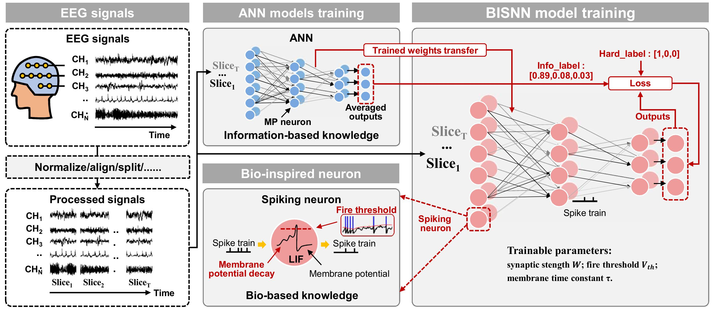

# BISNN: bio-information-fused spiking neural networks for enhanced EEG-based emotion recognition
[Hongze Sun](https://scholar.google.com/citations?user=RNa8D1sAAAAJ&hl=en) • Shifeng Mao • [Wuque Cai](https://scholar.google.com/citations?user=wotvHt4AAAAJ&hl=en) • [Yan Cui](https://scholar.google.com/citations?user=OQfhoSsAAAAJ&hl=en) • Duo Chen • [Dezhong Yao](https://scholar.google.com/citations?user=ClUoWqsAAAAJ&hl=en) and [Daqing Guo](https://scholar.google.com/citations?user=r3XU9PEAAAAJ&hl=en)

## Abstract
Spiking neural networks (SNNs), known for their rich spatio-temporal dynamics, have recently gained considerable attention in EEG-based emotion recognition. However, conventional model training approaches often fail to fully exploit the capabilities of SNNs, posing challenges for effective EEG data analysis. In this work, we propose a novel bioinformation-fused SNN (BISNN) model to enhance EEG-based emotion recognition. The BISNN model incorporates biologically plausible intrinsic parameters into spiking neurons and is initialized with a structurally equivalent pre-trained ANN model. By constructing a bio-information-fused loss function, the BISNN model enables simultaneous training under dual constraints. Extensive experiments on benchmark EEG-based emotion datasets demonstrate that the BISNN model achieves competitive performance compared to state-of-the-art methods. Additionally, ablation studies investigating various components further elucidate the mechanisms underlying the model’s effectiveness and evolution, aligning well with previous findings.

## BISNN

Fig. 1. Overview of the training process for the proposed BISNN method in EEG-based emotion recognition. Preprocessed EEG signals are divided into T slices to reduce temporal feature complexity. The pretrained weights from an ANN model, enriched with information based knowledge, are transferred to a homogeneous BISNN model composed of bio-inspired neurons. During the BISNN training phase, the loss function incorporates both info_label and hard_label to further enhance bio-information learning.

## Requirements
The following setup is tested and it is working:

 * numpy>=1.18.5
   
 * torch>=1.7.1+cu110

## Training
We have given demos on BISNN models trained with DEAP emotion recognition dataset.
```
run main_deap_conv1d.py
run main_deap_fc.py
```
You can change the hyper-parameters and network architectures to what you need in files ```models/ANNs.py``` or ```models/SNNs.py``` and ```func.py```.

## Citation
Please cite our [paper]([https://ieeexplore.ieee.org/stamp/stamp.jsp?tp=&arnumber=10136703](https://link.springer.com/article/10.1007/s11571-025-10239-9#citeas)) if you find the work useful.
```
@ARTICLE{
  author={Sun, Hongze and Mao, Shifeng and Cai, Wuque and Cui, Yan and Chen, Duo and Yao, Dezhong and Guo, Daqing},
  journal={Cognitive Neurodynamics}, 
  title={BISNN: bio-information-fused spiking neural networks for enhanced EEG-based emotion recognition}, 
  year={2025},
  volume={19},
  number={1},
  pages={1-12},
  doi={10.1007/s11571-025-10239-9}}
```

